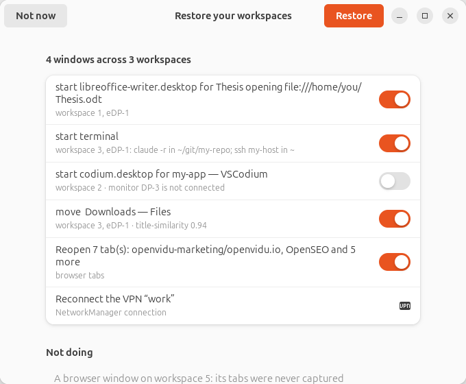

# restore-wss — put the workspaces back the way they were

```console
curl -fsSL https://raw.githubusercontent.com/gortazar/restore-wss/main/install.sh | sh
```

Then log out and back in (Wayland cannot load a Shell extension in place), and:

```console
$ gnome-extensions enable session-core@restore-wss.patxi
$ restore-wss status
```

## What it is for

You shut the laptop down with seven workspaces full of work: a thesis in LibreOffice, an editor
with a project open, a terminal in a repo running an agent, another holding an `ssh` session, a VPN
up. After the reboot the desktop is empty.

`restore-wss` puts it back:

```console
$ restore-wss restore --dry-run
Restoring 4 window(s) across 3 workspace(s):
   [0] start libreoffice-writer.desktop for Thesis opening file:///home/you/Thesis.odt → workspace 1, eDP-1
   [1] start codium.desktop for my-app — VSCodium → workspace 2, DP-3
   [2] start terminal → workspace 3, eDP-1: claude -r in /home/you/git/my-repo; ssh my-host in /home/you
 ? [3] start org.gnome.Nautilus.desktop for Downloads → workspace 3, eDP-1
   ask   patxi@host: ~: could be 'patxi@host: ~/tmp' (score 0.93) — too close to call, left alone
   vpn   reconnect work
   leaving alone: Inbox — Mail
```

Nothing happens until you say so. `restore` asks; `--yes` is a flag, not the default.

At the first login after a reboot — if you have turned that on — the same plan arrives as a window
instead, with the doubtful items switched off:



## Browser tabs

Tabs work **with no browser add-on at all**: restore-wss reads Firefox's own session file, which
carries every window's tabs, their titles, pinned state and the selected tab. That is what Firefox
last wrote down — usually seconds old, occasionally minutes — and it needs no permission from you.

```console
$ restore-wss status
Workspace 4
  [eDP-1 1165x1408] M Dedicación Mica y Patxi - Google Sheets — Mozilla Firefox
      8 tab(s): Content planning - Google Sheets; Interviews - Google Docs; …6 more
```

Install the add-on as well and the state becomes live rather than last-flushed:

```console
$ firefox ~/.local/share/restore-wss/restore-wss-firefox.xpi
```

Restoring is **reconciliation**, because Firefox's own "restore previous session" stays on: a window
Firefox brought back itself is left alone, one it did not is created with its tabs in order, and tabs
are never appended to a window you have since been using. Running `restore` twice changes nothing the
second time.

### The Firefox add-on

The add-on is in the release tarball as `browser-extension.xpi`. Release Firefox installs only
**signed** add-ons, and signing an add-on means signing it with *an* AMO account — so it is signed
here only when this repository has `AMO_JWT_ISSUER` and `AMO_JWT_SECRET` configured; the workflow
runs `web-ext sign --channel unlisted` and attaches `restore-wss-firefox-signed.xpi`. Without those
secrets the asset is unsigned, which is installable in Developer Edition, Nightly, or as a temporary
add-on — and the session-file route above needs none of it.

What the add-on can see, plainly: the address and title of every page in every non-private window.
Private windows are never reported. `browsers.enabled = false`, `browsers.exclude_urls` and
`browsers.store = "titles"` are all in [docs/limitations.md](docs/limitations.md#browsers-and-tabs-v02).

## How it works, in one paragraph

The snapshot is written **continuously**, not at logout — a design forced by the fact that the
session you want back is the one that was lost to a power cut. A GNOME Shell extension inside the
compositor reports windows, workspaces and monitors and places them again; a Python daemon outside
it owns the snapshot, walks `/proc`, applies the policy and talks to NetworkManager. The snapshot
is written atomically, with the previous generation kept, so an unclean shutdown never leaves half
a file.

## The parts you should know about before installing

* **Captured commands are not re-run by default unless they are on an allow-list.** Reopening a
  terminal at its working directory always happens; re-running what was in it happens for `ssh`,
  `claude`, editors, pagers and monitors, and is *offered* for anything else. `rm`, `sudo`, `git`
  and package managers are never re-run automatically. See
  [docs/limitations.md](docs/limitations.md#terminals-and-commands-specifically).
* **Credential-shaped arguments are redacted at capture time**, so they are never written to disk,
  and a command with a redaction in it is never re-run automatically.
* **Everything stays on this machine.** `~/.restore-wss/state/` is mode `0700`, the files are plain
  JSON, and deleting them is a supported way to say "forget all that".

## Commands

| Command | What it does |
| --- | --- |
| `restore-wss status [--json]` | what is captured now, and whether it came from the daemon or from disk |
| `restore-wss save` | force a snapshot now |
| `restore-wss list [--json]` | the snapshots on disk (there are at most two, by design) |
| `restore-wss diff [--json]` | what would change if the snapshot were restored right now |
| `restore-wss restore [--dry-run] [--yes] [--gui] [--json]` | show the plan, then carry it out |
| `restore-wss daemon` | the capture loop (normally the systemd user unit) |
| `restore-wss login-check` | the autostart entry's "was there a reboot?" check |

## Configuration

`~/.restore-wss/config.toml`, all optional — the command policy, exclusions, a pause switch and
whether to offer a restore at login. The full reference is in
[docs/state-schema.md](docs/state-schema.md#configtoml).

## Development

```console
$ nix develop        # python, pytest, ruff, gjs, dbus
$ make test          # unit + D-Bus suites and lint
$ nix flake check    # the same, hermetically — what CI runs
$ tools/smoke-nested.sh   # the whole thing against a real headless GNOME Shell
```

`make install` copies the extension into `~/.local/share/gnome-shell/extensions/` from a checkout.

## Documentation

| Document | What it covers |
| --- | --- |
| [docs/similar-tools.md](docs/similar-tools.md) | Prior art: eleven tools read from source, what each cannot do, and what this takes from it |
| [docs/platform-findings.md](docs/platform-findings.md) | What GNOME 46/Wayland actually exposes, measured here |
| [docs/state-schema.md](docs/state-schema.md) | The snapshot and config formats, and how they are written |
| [docs/app-adapters.md](docs/app-adapters.md) | The document tier model and how to add an application |
| [docs/limitations.md](docs/limitations.md) | What cannot be restored, and why |
| [docs/shared-core.md](docs/shared-core.md) | `org.gnome.SessionCore`, the reusable compositor-side half |
| [docs/browser-extensions-research.md](docs/browser-extensions-research.md) | Browser prior art, the snap-confinement findings, and the go/no-go behind the design above |

## Licence

GPL-2.0-or-later. The extension half has to be, and the rest matches it.
